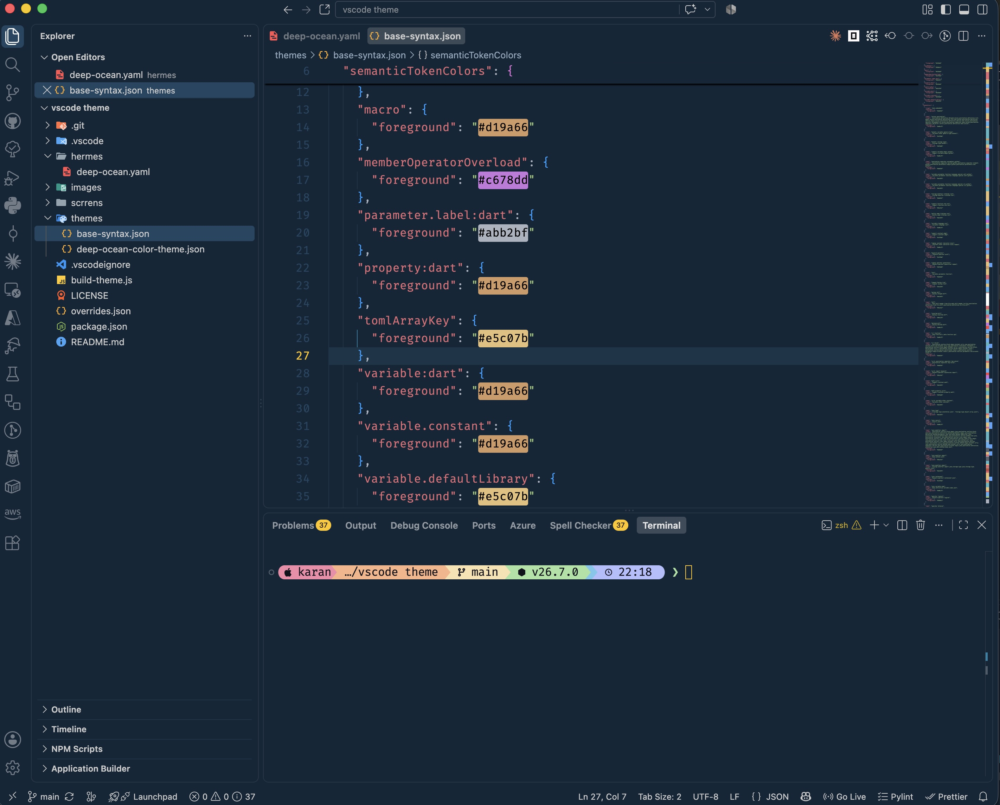
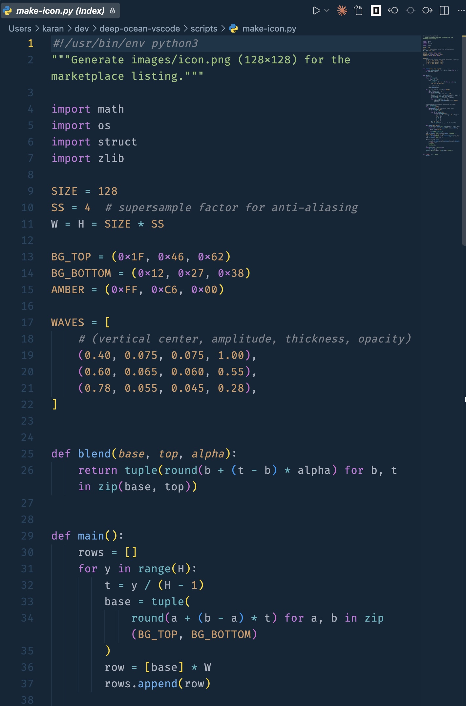
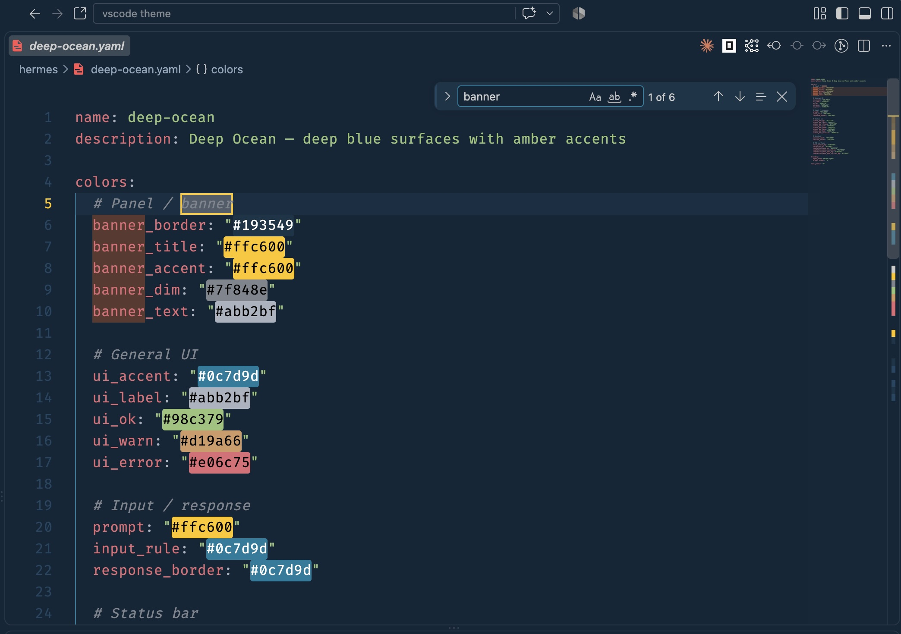
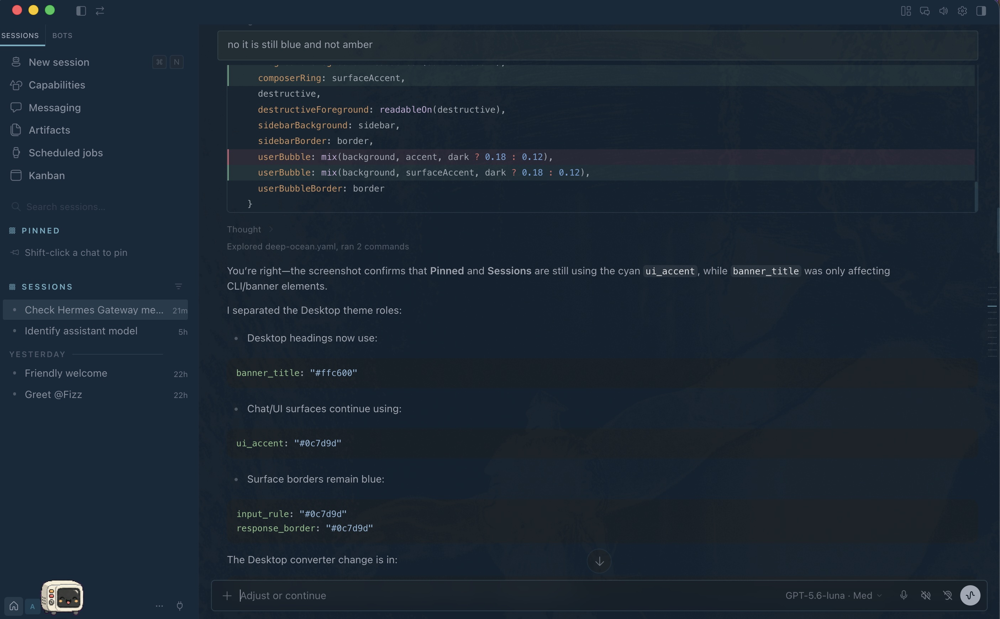

# Deep Ocean Amber

A dark VS Code theme with deep blue backgrounds (`#122738` / `#193549` / `#1f4662`)
and amber accents (`#ffc600`).

The palette comes from [Cobalt2](https://github.com/wesbos/cobalt2-vscode) by
Wes Bos, and the syntax highlighting from
[One Dark Pro](https://github.com/Binaryify/OneDark-Pro) by Binaryify — both
MIT. See `LICENSE` for the notices.

## Screenshots

#### The full workbench — explorer, editor, integrated terminal:



#### Python:



#### YAML



## Hermes Desktop

The same palette ported to Hermes Desktop,
so a terminal-side session matches the editor. This is a separate application —
nothing here affects VS Code.



`hermes/deep-ocean.yaml` maps the same blues and amber onto Hermes' own surface
names (banner, status bar, prompt, TUI panels). Copy it into your Hermes themes
directory to use it.

## Nice to have settings

The theme only sets colors. These settings are what it was tuned against —
add them to your `settings.json`:

```json
{
  "workbench.colorTheme": "Deep Ocean Amber",
  "editor.fontFamily": "'FiraCode Nerd Font', Consolas, monospace",
  "editor.fontLigatures": true,
  "editor.fontSize": 16,
  "editor.fontWeight": "400",
  "editor.lineHeight": 25,
  "editor.letterSpacing": 0.3,
  "editor.cursorStyle": "line",
  "editor.cursorWidth": 2,
  "editor.cursorBlinking": "smooth",
  "terminal.integrated.fontFamily": "'FiraCode Nerd Font Mono'",
  "terminal.integrated.fontSize": 16
}
```

[FiraCode Nerd Font](https://github.com/ryanoasis/nerd-fonts/releases).
The ligatures (`editor.fontLigatures`) are what turn `=>` and `!==` into single
glyphs — the theme looks fine without them, but that's how it was designed.

Any monospace font works. If you'd rather not install one, drop
`editor.fontFamily` and `terminal.integrated.fontFamily` and keep the rest.

## Using different syntax colors

The theme's workbench colors and its syntax highlighting are independent. To
keep the Deep Ocean Amber UI but colour code differently, override the syntax in
your `settings.json`:

```json
"editor.tokenColorCustomizations": {
  "[Deep Ocean Amber]": {
    "comments": "#7f848e",
    "strings": "#98c379",
    "keywords": "#c678dd",
    "numbers": "#d19a66",
    "types": "#e5c07b",
    "functions": "#61afef",
    "variables": "#e06c75"
  }
}
```

The `[Deep Ocean Amber]` scope keeps the override from applying to your other
themes. Those seven names are shorthand for common TextMate scopes; for finer
control use `textMateRules` instead:

```json
"editor.tokenColorCustomizations": {
  "[Deep Ocean Amber]": {
    "textMateRules": [
      {
        "scope": ["entity.name.tag", "support.type.property-name"],
        "settings": { "foreground": "#e06c75", "fontStyle": "italic" }
      }
    ]
  }
}
```

Run **Developer: Inspect Editor Tokens and Scopes** from the command palette to
find the scope name under the cursor.

Note that this only works in one direction. Themes cannot inherit from each
other across extensions, so there is no way to select a different theme and pull
in Deep Ocean Amber's workbench colors — the colors would have to be pasted into
`workbench.colorCustomizations` by hand.

## Editing colors

`themes/deep-ocean-color-theme.json` is generated — don't edit it by hand.
`overrides.json` holds the workbench colors and `themes/base-syntax.json` the
syntax colors. Change `overrides.json`, then run:

```
node build-theme.js
```

A value of `"default"` in `overrides.json` means "keep the base theme's value".

VS Code caches parsed themes keyed by extension version, so rewriting the theme
file alone is not enough for a running window to show new colors. The build
therefore also bumps the patch version, repoints the symlink in
`~/.vscode/extensions`, and updates that directory's `extensions.json`. Run
**Developer: Reload Window** afterwards.

Pass `--no-install` to rewrite the theme file without bumping or relinking:

```
node build-theme.js --no-install
```

## Previewing

Open this folder in VS Code and press `F5` to launch an Extension Development
Host, then pick **Deep Ocean Amber** from the theme picker.
